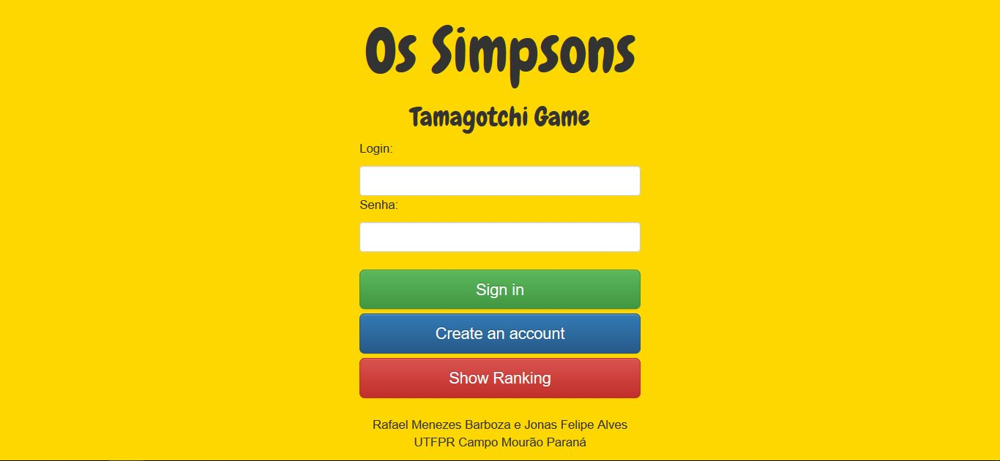

# Os Simpsons Tamagotchi Game
--------------------------
O projeto faz parte de uma atividade da matéria de Linguagens de Programação do curso de Ciência da Computação UTFPR - Campo Mourão. Propõe a implementação de um Tamagotchi utilizado a linguagem C# ASP.NET Web Forms, server side.

## MongoDB
Foi utilizado como base de dados o Mongodb não relacional, e para a execução plena da aplicação é necessário a instalação do mesmo o link para download segue abaixo.

https://www.mongodb.com/download-center#atlas

## Preview

       

